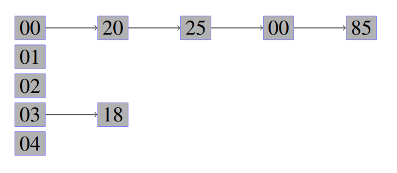

 
 
 
</a> 

# Tabela Hash

 Implementação de duas tabelas hash: 

 I) endereçamento fechado e; 

 II) endereçamento aberto por hash dupla. 

 O trabalho deve receber diretamente no seu código um vetor de no mínimo 20 valores inteiros, os quais serão utilizados como entrada  para as duas estruturas que, por sua vez, são criadas com o dobro do tamanho do vetor (i.e., número primo maior que esse valor dobro). 

 Feito isso, como resultado da execução deve-se apresentar o número de colisões ocorridas para ambas as estruturas quando o mesmo vetor é armazenado. Por fim, contemplar no README.mb uma breve discussão dos motivos que levaram uma estrutura a apresentar melhores resultados. 

## Endereçamento fechado

 Também encontrado como Overflow Progressivo Encadeado é um algoritmo que utiliza uma lista encadeada para cada endereço da tabela. Uma vantagem do endereçamento fechado é que o processo de construção é simples e só sinônimos são acessados com maior tempo em uma busca. Uma desvantagem é que é necessário um campo extra para os ponteiros de ligação e de que é necessário um tratamento especial das chaves: as que estão com endereço base e as que estão encadeadas. 

 No endereçamento fechado a busca é feita, primeiramente, calculando-se o
valor da função hash para a chave apresentada como entrada.
Feito a conversão da chave em uma posição, o dado é encontrado
caminhando-se sequencialmente pela lista linear 
 

 
 

 
 
 

 Outra desvantagem é A possibilidade de se obter uma lista linear sequêncial. 

## Endereçamento aberto

 Endereçamento aberto é utilizado quando o número de registros a serem armazenados na tabela puder ser previamente estimados. 

> Para que essa estratégia corresponda bem as espectativas é preciso manter o fator M > N, onde, M é o tamanho da tabela e N o número de elementos a serem inseridos.

 As características dessa estratégia tornam possível a alocação de todos os registros no próprio espaço da tabela sem a necessidade de listas encadeadas auxiliares 

### Endereçamento aberto duplo

> Note que o conceito de hash linear pode não gerar um bom espalhamento dos dados pelo vetor. Para isso, tem-se o hashing duplo ou re-hash

 No hash duplo não há incrementos em 1 a cada interação. Nesse, uma segunda
função hash (função auxiliar) é utilizada para calcular a nova posição. 

 Uma vantagem é que o endereçamento aberto de hash dupla tende a espalhar melhor as chaves pelos endereços disponíveis. Já uma desvantagem é de que os endereços podem estar muito distântes um do outro fazendo com que o princípio da localidade seja violada. Isso provoca seeking adicionais. 

## Desenvolvimento do problema

### Hash fechada

### Hash aberta dupla

# Compilação e Execução

O algoritmo disponibilizado possui um arquivo Makefile que realiza todo o procedimento de compilação e execução. Para tanto, temos as seguintes diretrizes de execução:

| Comando                |  Função                                                                                           |
| -----------------------| ------------------------------------------------------------------------------------------------- |
|  `make clean`          | Apaga a última compilação realizada contida na pasta build                                        |
|  `make`                | Executa a compilação do programa utilizando o gcc, e o resultado vai para a pasta build           |
|  `make run`            | Executa o programa da pasta build após a realização da compilação                                 |

# Contatos

 Thaissa Vitória

<a href="https://t.me/thaissadaldegan">
 

 Bárbara Gualberto

<a href="https://t.me/barbrinas">
 

